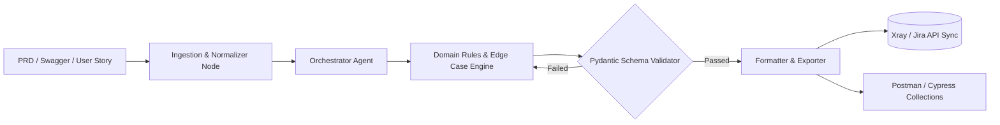

# 🧪 Autonomous AI Test Case & Scenario Generation Engine
> **Enterprise QA Case Study & Architecture Overview**

[-blue.svg)](#)

An end-to-end, LLM-powered test design automation framework built to eliminate manual test creation bottlenecks. The system parses PRDs, OpenAPI/Swagger specifications, and Figma user flows to generate production-ready **Gherkin (BDD)** test suites, integration test matrices, and direct sync payloads for enterprise test management platforms.

---

## 🎯 The Business & Technical Problem
- **Manual Overhead:** QA teams spend 30-40% of sprint time manually writing boilerplate Given-When-Then scenarios and boundary checks.
- **Contract Drift:** Frequent API schema updates lead to outdated regression test sets.
- **Hallucination Risk:** Standard LLMs produce unparseable test steps with invalid parameters if unconstrained.

---

## 🏗️ System Architecture & Workflow

a sample screenshot from the output:

