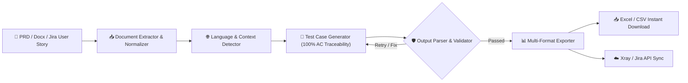
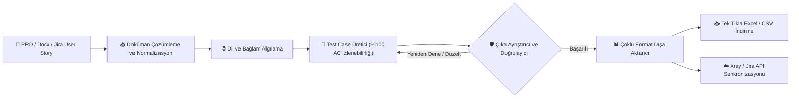

[EN]

# 🧪 Autonomous AI Test Case & Scenario Generation Engine
> **Enterprise QA Case Study & Architecture Overview**

[-blue.svg)](#)

An end-to-end, LLM-powered test design automation framework built to eliminate manual test creation bottlenecks. The system parses PRDs, OpenAPI/Swagger specifications, and Figma user flows to generate production-ready **Gherkin (BDD)** test suites, integration test matrices, and direct sync payloads for enterprise test management platforms.

---

## 🎯 The Business & Technical Problem
- **Manual Overhead:** QA teams spend 30-40% of sprint time manually writing boilerplate Given-When-Then scenarios and boundary checks.
- **Contract Drift:** Frequent API schema updates lead to outdated regression test sets.
- **Hallucination Risk:** Standard LLMs produce unparseable test steps with invalid parameters if unconstrained.

---

## 🏗️ System Architecture & Workflow

---

### 🇬🇧 İngilizce Diyagram Kodu:

a sample screenshot from the output:

### 💡 Key Architectural Highlights

* **100% Acceptance Criteria Traceability:** Eliminates LLM summarization bias by enforcing strict 1:1 test case mapping against every defined Acceptance Criteria (AC-01 through AC-10+) with zero blindspots.
* **Deterministic Contract Enforcement:** Guarantees strict JSON schema outputs, eliminating markdown fence formatting hallucinations.
* **Client-Side Zero-Dependency Export:** Generates instant UTF-8 BOM encoded CSV/Excel files via browser memory (Base64 Data URI), bypassing cloud storage permission hurdles and character encoding corruptions.
* **Localization-Aware BDD:** Preserves native domain language (e.g., Turkish financial terminology) while maintaining standardized international Gherkin syntax.

[TR]

# 🧪 Otonom Yapay Zeka Test Senaryosu ve Tasarım Motoru
> **Kurumsal QA Vaka Analizi ve Sistem Mimarisi**

[-blue.svg)](#)

Manuel test senaryosu hazırlığındaki iş yükünü ve süreç tıkanıklıklarını ortadan kaldırmak amacıyla geliştirilmiş, LLM destekli uçtan uca bir test otomasyon çerçevesidir. Sistem; analiz dokümanlarını (PRD), OpenAPI/Swagger tanımlarını ve kullanıcı akışlarını çözümleyerek prodüksiyona hazır **Gherkin (BDD)** test paketleri, entegrasyon matrisleri ve kurumsal test yönetim araçlarıyla doğrudan senkronize olabilen veri paketleri üretir.

---

## 🎯 Çözülen İş ve Mühendislik Problemleri
- **Manuel İş Yükü:** QA ekipleri sprint sürelerinin %30-40'ını şablon Given-When-Then senaryoları ve sınır değer kontrolleri yazmakla geçirir.
- **İzlenebilirlik ve Kapsama Boşlukları:** Standart yapay zeka modelleri, serbest özetleme eğilimleri nedeniyle kritik kabul kriterlerini ve uç durumları (bloke hesap, denetim logları, idempotency) atlayarak riskli test kör noktaları oluşturur.
- **Sözleşme Uyuşmazlığı (Contract Drift):** Sık değişen API şemaları ve iş kuralları, regresyon test setlerinin hızla güncelliğini yitirmesine yol açar.
- **Halüsinasyon Riski:** Kısıtlanmamış LLM'ler, ayrıştırılamayan test adımları ve geçersiz parametreler üreterek otomasyonu kırabilir.

---

## 🏗️ Sistem Mimarisi ve İş Akışı

Çıktıdan örnek bir ekran görüntüsü:

### 💡 Öne Çıkan Mimari Özellikler

* **%100 Kabul Kriteri İzlenebilirliği:** Tanımlanan her bir Kabul Kriterine (AC-01'den AC-10+'a kadar) birebir karşılık gelen müstakil bir test senaryosu üreterek LLM'lerin özetleme zaafını ve test kör noktalarını tamamen ortadan kaldırır.
* **Deterministik Şema Güvencesi:** Katı JSON şeması kurallarıyla Markdown blok kirliliğini ve format halüsinasyonlarını engeller.
* **İstemci Taraflı Sıfır Bağımlılıklı Dışa Aktarım:** Bulut depolama izinlerine ve 403 yetki kısıtlamalarına takılmadan, doğrudan tarayıcı belleği (Base64 Data URI) üzerinden UTF-8 BOM destekli ve Excel ile doğrudan uyumlu CSV dosyaları üretir.
* **Yerelleştirme Uyumlu BDD:** Türkçe iş ve bankacılık terminolojisini korurken, uluslararası standart Given-When-Then Gherkin sentaksını eksiksiz muhafaza eder.
